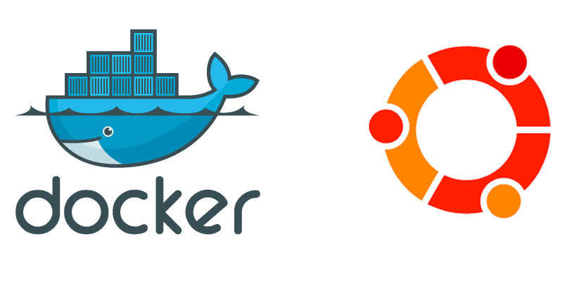

<div align="center" id="top">
  

  &#xa0;

  <!-- <a href="https://lamp.netlify.app">Demo</a> -->
</div>

<h1 align="center">LAMP base</h1>

<p align="center">
  

  

  

  

  <!--  -->

  <!--  -->

  <!--  -->
</p>

<!-- Status -->

<!-- <h4 align="center">
	🚧  Lamp 🚀 Under construction...  🚧
</h4>

<hr> -->

<p align="center">
  <a href="#dart-about">About</a> &#xa0; | &#xa0;
  <a href="#sparkles-features">Features</a> &#xa0; | &#xa0;
  <a href="#rocket-technologies">Technologies</a> &#xa0; | &#xa0;
  <a href="#white_check_mark-requirements">Requirements</a> &#xa0; | &#xa0;
  <a href="#checkered_flag-starting">Starting</a> &#xa0; | &#xa0;
  <a href="#memo-license">License</a> &#xa0; | &#xa0;
  <a href="https://github.com/admorenong" target="_blank">Author</a>
</p>

<br>

## 🎯 About ##

Variable container configuration for multiple LAMP stack projects ready to start.

## ⚡️ Features ##

- ✅ apache
- ✅ php 8
- ✅ xdebug 3
- ✅ phpstorm debug config
- ✅ vscode debug config
- ✅ user and group configuration in project folder without root.

## 🚀 Technologies ##

The following tools were used in this project:

- [Docker](https://docker.com/)

## ✅ Requirements ##

Before starting :checkered_flag:, you need to have [Git](https://git-scm.com) and [Node](https://nodejs.org/en/) installed.

## ✓ Starting ##

```bash
# Clone this project
$ git clone https://github.com/admorenog/laravel-base

# Access
$ cd laravel-base

# Install dependencies
$ yarn

# Run the project
$ yarn start

# The server will initialize in the <http://localhost:3000>
```

## 📖 License ##

This project is under license from MIT. For more details, see the [LICENSE](LICENSE.md) file.


Made with ❤️ by <a href="https://github.com/admorenog/" target="_blank">Adrián</a>

&#xa0;

<a href="#top">Back to top</a>
